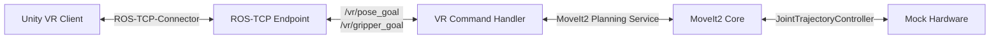

# 🤖 VRobot: ROS2 Humble - Unity VR 로봇 제어 시스템

본 프로젝트는 Windows Unity VR 환경에서 Ubuntu ROS2 Humble 상의 **두산로봇 E0509(6축 협동로봇)** 및 **RH-P12-RN-A(그리퍼)**를 실시간 모션 플래닝 및 제어하기 위한 ROS2 제어 인프라와 통신 브리지 패키지입니다.

---

## 🛠️ 핵심 아키텍처 및 시스템 구성



### 1. 주요 패키지
*   **`vrobot_description`:** 로봇 팔 E0509와 그리퍼의 URDF 결합 모델 및 모의 하드웨어(Mock Control) 구성 정의.
*   **`vrobot_moveit_config`:** 로봇 팔 및 그리퍼의 Planning Group(`doosan_arm`, `gripper`) 정의와 Kinematics 해석 및 충돌 맵핑(SRDF) 설정.
*   **`vrobot_command`:** Unity VR 제어 명령을 해석하고 MoveIt2 플래너와 안전하게 중계 및 실행하는 코어 제어 핸들러 노드 탑재.

### 2. 주요 기능
*   **단방향 관절 동기화:** ROS2 시뮬레이터의 현재 관절 상태(`/joint_states`)를 Unity 내의 디지털 트윈 로봇에 1:1로 실시간 전송 및 시각화 보정.
*   **Way-point 모션 플래닝:** 유니티 내 조종 구체(`Target_Handle`)의 좌표(Unity Left-handed ➔ ROS2 Right-handed 변환식)를 바탕으로 MoveIt2가 최적의 충돌 회피 경로를 자동 생성 및 안전 구동.
*   **그리퍼 개폐 연동:** `/vr/gripper_goal` 명령을 통한 핑거 관절 제어 및 동기화 구현.

---

## 🏃 기동 및 가동 방법

자세한 트러블슈팅 및 가이드는 [Run_Guide.md](Run_Guide.md)를 참고해 주십시오.

### [터미널 1] 로봇 본체 시뮬레이터 실행
```bash
ros2 launch vrobot_description vrobot_full_sim.launch.py
```

### [터미널 2] ROS-TCP 브리지 및 제어기 구동
```bash
ros2 launch vrobot_command unity_control.launch.py execute_enabled:=true
```
*(기동이 확인되면 Windows Unity에서 `192.168.23.130:10000` 주소로 접속해 제어를 시작합니다.)*
