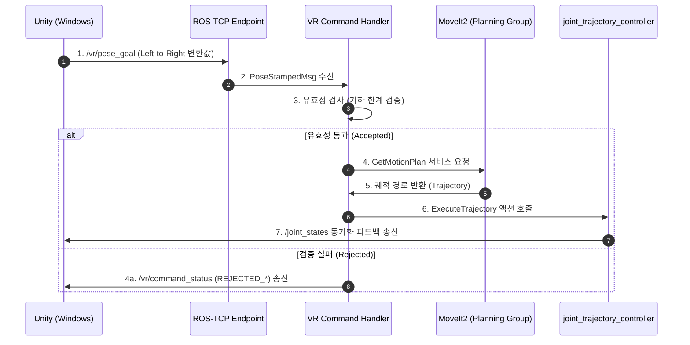

# 🤖 VRobot: ROS2 Humble ↔ Unity 로봇 제어 시스템

[](https://docs.ros.org/en/humble/)
[](https://unity.com/)
[](https://opensource.org/licenses/MIT)

본 프로젝트는 Windows Unity 기반의 조종 핸들러 인터페이스와 Ubuntu ROS2 Humble 제어 코어를 연결하여, **두산로봇 E0509(6축 협동 로봇)** 및 **RH-P12-RN-A(1자유도 그리퍼)** 디지털 트윈의 실시간 모니터링 및 모션 플래닝을 중계하는 통합 제어 인프라입니다.

---

## 📐 시스템 아키텍처 및 데이터 흐름



---

## ⚙️ 하드웨어 명세 (Hardware Specifications)

| 분류 | 하드웨어 컴포넌트 | 자유도 (DOF) | 특징 및 제어 사양 |
| :--- | :--- | :--- | :--- |
| **Arm** | **Doosan E0509** | 6 DOF | 최대 도달 반경(Reach) **0.9m**, 가용 페이로드 **5.0kg** |
| **Gripper** | **ROBOTIS RH-P12-RN-A** | 1 DOF | 평행 그리퍼, 가동 범위 **0.0(열림) ~ 0.8(닫힘)** |

---

## 📂 패키지 구조 및 핵심 노드 상세

### 1. `vrobot_description`
로봇 팔과 그리퍼를 물리적/시각적으로 결합한 URDF 모델링의 중심입니다.
*   `vrobot.urdf.xacro`: E0509 `link_6` 말단 플랜지와 그리퍼 `rh_p12_rn_base`를 고정 조인트로 결합하고, 모의 구동용 `use_fake_hardware` 인터페이스 제어 태그 분리 탑재.

### 2. `vrobot_moveit_config`
동적 궤적 생성과 충돌 회피 계산을 담당하는 MoveIt2 핵심 환경 구성입니다.
*   기하학적 자가 충돌 Matrix(SRDF) 및 KDL Kinematics 수치 제공.
*   `joint_limits.yaml`: 팔의 급격한 구동을 제어하기 위한 가속도 및 저속 모션 세이프티 마진 수치 정의.

### 3. `vrobot_command` (제어 중계부)
유니티로부터 들어오는 조종 데이터를 받아 ROS2 환경과 동기화하는 코어 핸들러가 포함되어 있습니다.
*   **`vr_command_handler.py`:** 실시간 토픽 수신, 통신 모니터링 Watchdog, 그리고 MoveIt2 Kinematic Plan 호출 및 Trajectory 실행 관리 수행.


---

## 🔌 통신 인터페이스 규격 (ROS2 Topic & Message)

### 📥 수신 토픽 (Unity ➔ ROS2)
*   **`/vr/pose_goal`** (`geometry_msgs/msg/PoseStamped`)
    *   Unity 타깃 구체(`Target_Handle`)의 실시간 상대 좌표 및 쿼터니언 자세 목표값.
*   **`/vr/gripper_goal`** (`std_msgs/msg/Float64`)
    *   그리퍼 가동 범위 타깃 명령값 ($0.0 \sim 0.8$).

### 📤 송신 토픽 (ROS2 ➔ Unity)
*   **`/joint_states`** (`sensor_msgs/msg/JointState`)
    *   로봇 시뮬레이터의 10축(팔 6축 + 그리퍼 4축) 관절 회전 각도 피드백 (시각화 동기화용).
*   **`/vr/command_status`** (`std_msgs/msg/String`)
    *   현재 명령 처리 상태 피드백 (`ACCEPTED` / `PLANNED` / `EXECUTED` / `REJECTED_*` / `FAILED_*`).

---

## 🛠️ 핵심 제어 매개변수 설정 (Configuration Parameters)

`vrobot_command/config/vr_command_handler.yaml`에서 로봇의 모션 플래닝 감도 및 허용 오차 제어를 튜닝할 수 있습니다.

```yaml
vr_command_handler:
  ros__parameters:
    workspace_enabled: false            # 안전 작업 영역(수치 한계) 체크 활성화 여부
    allowed_planning_time: 5.0          # MoveIt2 궤적 생성 시간 초과 임계치 (초)
    position_tolerance: 0.005           # 목표 도달 위치 허용 오차 (5mm)
    orientation_tolerance: 0.01         # 목표 도달 자세 회전 허용 오차 (라디안, 약 0.57도)
    communication_watchdog_timeout: 0.5 # 제어 통신 두절 판단 타임아웃 (초)
```

---

## 🏃 실행 방법 (Quick Start Guide)

### 방법 A. 🖥️ 통합 대시보드 가동 (권장)
단일 터미널만 사용하여 GUI 제어 대시보드를 띄우고, 원클릭으로 로봇 구동 및 Unity 소켓 세션 모니터링을 통합 관리할 수 있습니다.

1.  **대시보드 기동:**
    ```bash
    python3 src/vrobot_command/scripts/vrobot_dashboard.py
    ```
2.  **통합 기동:** 대시보드 화면 좌측 상단의 **`🚀 START INTEGRATION`** 버튼을 누르면, 1단계(MoveIt2)와 2단계(Unity Mediator)를 DDS 디스커버리 타이밍에 맞추어 자동으로 순차 기동합니다.
3.  **유니티 연동:** 모든 노드 표시등이 초록색(🟢)이 되면 Windows Unity Editor에서 플레이(Play)를 켭니다. 소켓 세션이 성립되는 즉시 **`unity_runtime (Play Session)`** 램프가 🟢로 하이라이트됩니다.

---

### 방법 B. 💻 수동 터미널 기동 (개별 디버깅용)
각 컴포넌트의 터미널 출력을 개별적으로 확인해야 할 때 가동하는 전통적인 기동 방식입니다.

1.  **[터미널 1] 로봇 본체 시뮬레이터 및 RViz 구동**
    ```bash
    ros2 launch vrobot_description vrobot_full_sim.launch.py
    ```
2.  **[터미널 2] ROS-TCP 연결 엔드포인트 및 명령 제어 핸들러 구동**
    ```bash
    ros2 launch vrobot_command unity_control.launch.py execute_enabled:=true
    ```
    *   가동 후 브리지는 포트 `10000`에서 Unity 접속 대기 상태가 됩니다.
    *   Windows Unity 클라이언트 세팅 시 Ubuntu LAN IP(`192.168.23.130`)와 포트 `10000`을 매핑하여 접속합니다.

---

## 🚨 유용한 문제 해결 (Troubleshooting)

### 1. "OSError: [Errno 98] Address already in use" 에러 발생 시
*   **현상:** `ros_tcp_endpoint` 노드가 기동될 때 10000번 포트가 이전 세션의 좀비 프로세스 또는 TIME_WAIT 세션 상태로 잡혀 소켓 바인딩에 실패하여 통신이 작동하지 않는 현상입니다.
*   **해결:** 대시보드 내의 **`💥 Force Kill All`**을 클릭하거나, 터미널에서 아래 명령을 내려 10000번 소켓 리소스를 강제 정화하십시오.
    ```bash
    fuser -k 10000/tcp
    ```

### 2. "Exit code -11" 또는 "Segmentation fault" 에러 발생 시
*   **현상:** 이전 실행 시 백그라운드 프로세스가 원활히 닫히지 않고 좀비 상태로 메모리를 잡고 있어 일어나는 FastDDS 공유 메모리 충돌 현상입니다.
*   **해결:** 대시보드 내의 **`💥 Force Kill All`**을 누르거나, 터미널에서 아래 클린업 통합 명령을 내리십시오.
    ```bash
    fuser -k 10000/tcp; killall -9 ros2 rviz2 robot_state_publisher ros2_control_node move_group; rm -f /dev/shm/fastrtps_port*
    ```
